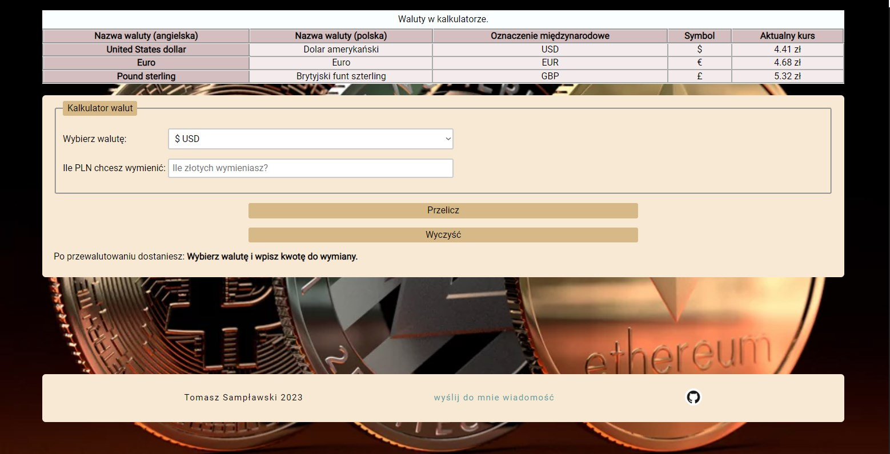

# Currency converter
a simple currency converter

You can try it under this [link](https://samplawski.github.io/currency-converter/).

## Table of Contents

1. Short description
2. Features
3. Technologies Used
4. Setup
5. How to use
6. Status and Contributing
7. Contact

## 1. Short Description
This is a simple Currency converter built as an exercise with the use of HTML and JavaScript. The styling was done with CSS accordingly to the BEM convention. It  allows you to quickly convert PLN (Polish złoty) to the three major currencies - USD (United States dollar), EUR (Euro), and GBP (British pound sterling).

## 2. Features

- Convert PLN to USD, EUR, and GBP
- Simple and intuitive user interface
- Responsive design that works on desktop and mobile devices
- links in the footer to: 
    - the project's GitHub repository
    - contact the creator via email

## 3. Technologies Used

The converter is built with the use of: 
- HTML
- CSS
- JavaScript
- BEM convention. 

The following external libraries are used in this project:

- normalize.css - for consistent styling across browsers
- Google Fonts - for the "Roboto" font used throughout the page

## 4. Setup

To run this application locally, follow these steps:

- Clone the repository to your local machine using git clone https://github.com/samplawski/currency-converter.git
- Navigate to the project directory using cd currency-converter
- In your preferred web browser open the file: index.html

## 5. How to use
1. Visit the converter page.
2. Select the currency you want to convert to from the dropdown list.
3. Enter the amount of PLN you want to exchange in the input field.
4. Click the "Przelicz" button to see the converted amount.
5. The "Wyczyść" button resets the form

## 6. Status and Contributing

The project was created by Tomasz Sampławski. It is currently completed but may be updated in the future. Contributions are welcome and appreciated! 

Feel free to use it for your own projects or modify it to suit your needs.
## 7. Contact

If you want to contact me you can reach me at tsamplawski@gmail.com.